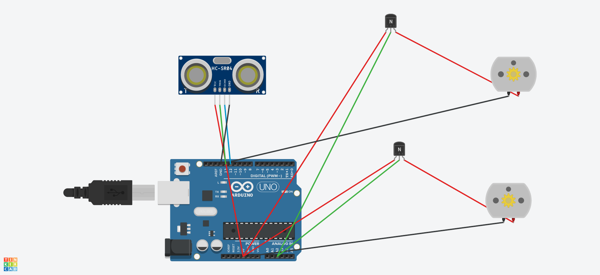

# Rover 360 - arduino-powered robot on wheels

Rover 360 is a wheeled robot with an arduino controller as the "brains".  
A sonar sensor ([HC-SR04](https://www.sparkfun.com/products/15569))
gives it obstacle-sensing capabilities.  
The arduino board is a [D1 mini](https://docs.wemos.cc/en/latest/d1/d1_mini.html).
The D1 mini provides wifi connectivity,  
which allows motion control over http over wifi.

[TinkerCad project](https://www.tinkercad.com/dashboard?type=all&collection=projects&id=3pKWTB0zhcN)
has a circuit with working simulation.  

